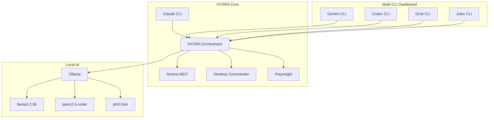

# HYDRA 10.6.1 Architecture

## System Overview



## Component Description

| Component | Purpose | Technology |
|-----------|---------|------------|
| HYDRA Orchestrator | Central coordination hub | Node.js + MCP SDK |
| Serena MCP | Code intelligence & symbol analysis | Symbolic code analysis |
| Desktop Commander | System operations & file management | Process/File management |
| Playwright | Browser automation & testing | Chromium-based |
| Ollama | Local AI inference engine | LLM runtime |
| Gemini CLI | Extended context & multimodal | Google Gemini API |
| Codex CLI | Code generation | OpenAI GPT-5-Codex |
| Grok CLI | Real-time analysis | xAI Grok API |
| Jules CLI | Async background tasks | Google Jules AI |

## SWARM Protocol Flow

The SWARM Protocol is the default execution mode with 6 orchestration steps:

1. **ROUTE** - Analyze query and select appropriate agents
2. **SPECULATE** - Researcher gathers context and background information
3. **PLAN** - Planner creates task division and execution strategy
4. **EXECUTE** - Agents execute tasks in parallel or sequential order
5. **SYNTHESIZE** - Merge results and resolve any conflicts
6. **REPORT** - Format response according to HYDRA response contract

## Multi-CLI Integration (Witcher Mode)

```
Long Context (>100K tokens)  → Gemini (2M context)
Code Generation              → HYDRA → DeepSeek
Background Tasks             → Jules (async)
Multi-language Support       → DeepSeek (100+ languages)
Symbolic Analysis            → HYDRA (Serena)
System Operations            → HYDRA (Desktop Commander)
```

## Project Structure

```
ClaudeHYDRA/
├── .claude/                 # Claude CLI configuration
│   ├── commands/            # 24 slash commands
│   ├── config/              # multi-cli.json configuration
│   ├── hydra/               # HYDRA specification files
│   └── skills/              # Custom skills
│
├── GeminiCLI/               # Google Gemini integration
├── JulesCLI/                # Google Jules integration
├── CodexCLI/                # OpenAI Codex integration
├── GrokCLI/                 # xAI Grok integration
├── DeepSeekCLI/             # DeepSeek integration
│
├── hydra-launcher/          # Tauri Desktop Application
├── docs/                    # Documentation (this directory)
├── CLAUDE.md                # Dashboard & quick reference
└── README.md                # Project overview
```

## Key Features

- **Multi-CLI Orchestration**: Route tasks to optimal AI providers
- **SWARM Protocol**: 6-step agent-based task execution
- **Local AI Support**: Ollama integration for offline inference
- **Code Intelligence**: Serena MCP for symbolic analysis
- **System Automation**: Desktop Commander for file/process operations
- **Browser Automation**: Playwright for web testing and interaction
